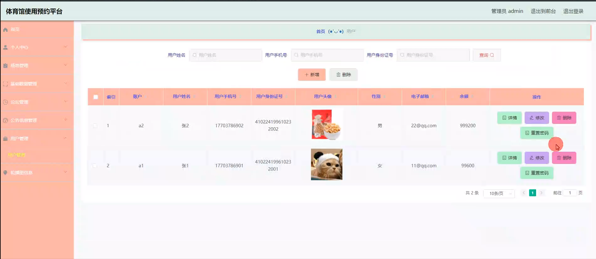

# 基于springboot的体育馆使用预约平台

---
### 👉作者QQ ：1556708905 微信：zheng0123Long (支持定制修改、部署调试、定制毕设)

### 👉接网站建设、小程序、H5、APP、各种系统等

---

#### 介绍

在人们对健康和体育活动日益重视的背景下，为了更高效地管理体育馆资源，方便用户进行场地预约，我们开发了这个基于 Spring Boot 的体育馆使用预约平台。该平台旨在为管理员和用户提供便捷、直观的操作界面，实现体育馆场地的合理分配和有效利用。

#### 技术栈

后端技术栈：Springboot+Mysql+Maven

前端技术栈：Vue+Html+Css+Javascript+ElementUI

开发工具：Idea+Vscode+Navicate

#### 系统功能介绍

（一）管理员角色  
个人中心：管理员在此查看和修改个人信息，接收重要通知和系统消息。  
场地管理：对体育馆内的各类场地进行全面管理，包括场地的添加、删除、修改，设置场地的基本信息（如场地名称、位置、面积、容纳人数等）、开放时间、收费标准等。  
场地收藏管理：查看用户对场地的收藏情况，了解热门场地和用户偏好，为场地优化和推广提供参考。  
场地订单管理：处理用户提交的场地预约订单，包括订单审核、确认、取消、退款等操作，确保订单流程的顺利进行。  
基础数据管理：维护系统中的基础数据，如体育项目分类、场地类型、支付方式等，为系统的正常运行提供数据支持。  
论坛管理：监督和管理用户在论坛中的发言和交流，审核帖子内容，处理违规信息，确保论坛的文明和有序。  
公告信息管理：发布体育馆的重要通知、活动信息、临时变更等公告，保证用户及时获取最新消息。  
用户管理：对注册用户的信息进行审核和管理，处理用户的账号问题，如封禁违规用户、解锁异常账号等。  
轮播图信息：设置平台首页的轮播图内容，展示热门场地、优惠活动、重要通知等，吸引用户关注。  

（二）用户角色  
个人中心：用户可以在个人中心修改个人资料，查看预约记录、订单状态、收藏的场地等信息。  
场地：浏览体育馆内可预约的场地详情，包括场地介绍、图片展示、收费标准、可预约时间等。  
论坛：在论坛中与其他用户交流体育心得、分享经验、组织活动等。  
公告信息：及时获取体育馆发布的各类公告，了解场地变动、优惠政策等重要信息。  
后台管理  
场地管理：对自己预约过的场地进行评价和反馈。  
论坛管理：发布和管理自己在论坛中的帖子和回复。  
公告信息管理：查看历史公告，确保不错过重要内容。  
轮播图信息：了解平台重点推荐的场地和活动。  

#### 系统作用

体育馆使用预约平台的主要作用包括：  

便捷预约： 提供一个集中和便捷的平台，让用户能够轻松预约和管理体育馆场地。  
提升用户体验： 通过丰富的功能模块，让用户能够浏览场地、提交预约申请、查看公告信息和参与论坛讨论等。  
高效管理： 管理员通过后台系统可以高效管理场地信息、预约订单、公告信息和用户，确保平台的顺利运营。  
信息传递： 通过公告信息和轮播图管理，管理员可以及时向用户传递最新的系统信息和活动资讯。  

#### 系统功能截图

代码结构

数据库表

登录

前台页面首页

场地

论坛

个人中心

管理员端场地管理

场地收藏

场地类型管理

论坛管理

用户管理

用户端后台管理

#### 总结

基于 Spring Boot 的体育馆使用预约平台通过清晰的角色划分和丰富的功能模块，为体育馆的运营管理和用户服务提供了有力的支持。管理员能够有效地管理场地资源和用户，用户能够便捷地预约场地和参与交流。这一平台的应用将推动体育馆的智能化管理和服务水平的提升，促进体育事业的发展。未来，我们将持续优化和完善系统，以适应不断变化的用户需求和市场环境。

#### 使用说明

创建数据库，执行数据库脚本 修改jdbc数据库连接参数 下载安装maven依赖jar 启动idea中的springboot项目

前台登录页面
http://localhost:8080/tiyuguan/front/index.html

后台登录页面
http://localhost:8080/tiyuguan/admin/dist/index.html

管理员 			账户:admin 	密码：admin
用户 			账户:a1 		密码：admin
用户 			账户:a2 		密码：admin